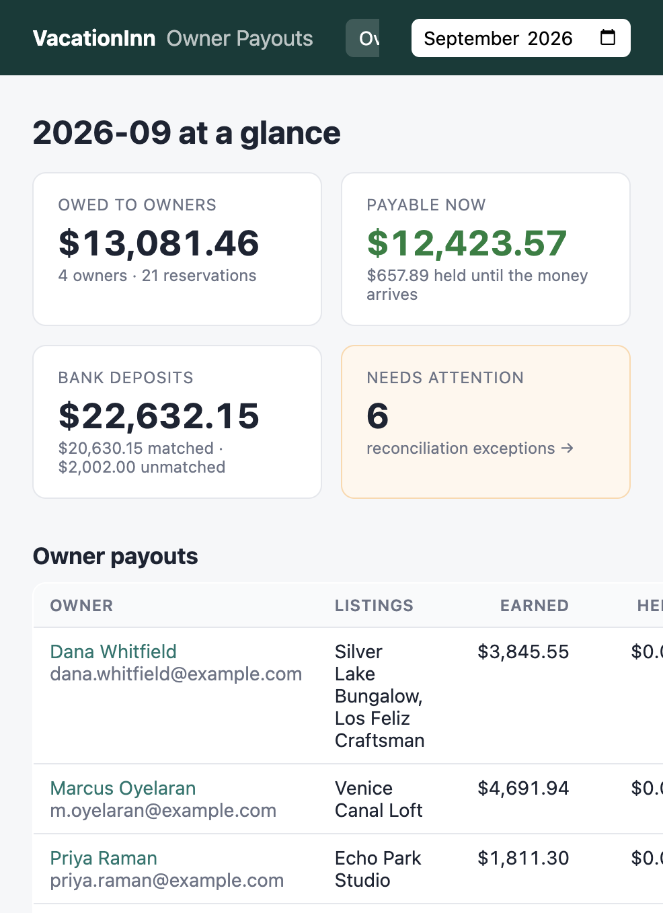
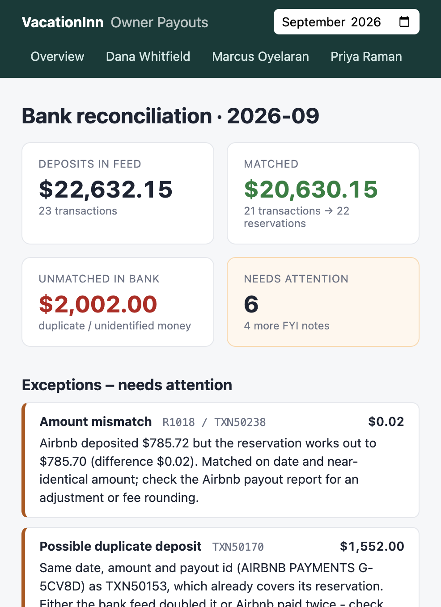

# VacationInn – September 2026 Owner Payouts & Bank Reconciliation

Takes the three CSV exports (reservations, owner agreements, bank deposits) and produces:

1. **Owner statements** for September 2026 – total per owner, broken down by listing and reservation, with every step of the math shown.
2. **A bank reconciliation** – every deposit matched to reservation(s), plus a list of everything that doesn't reconcile and why.

You can run it as a **CLI** (prints everything + writes CSVs) or a small **web UI** (Flask).



---

## How to run

Needs Python 3.9+.

```bash
python3 -m venv .venv
source .venv/bin/activate
pip install -r requirements.txt
```

**CLI**

```bash
python -m payouts.cli                          # September 2026, reads ./data, writes CSVs to ./output
python -m payouts.cli --owner "Priya Raman"    # just one owner's statement
python -m payouts.cli --month 2026-09 --data path/to/csvs --out somewhere/
```

It writes 5 files to `output/`:

| File | What's in it |
|---|---|
| `owner_totals_2026-09.csv` | one row per owner: earned, held, payable now |
| `owner_statement_lines_2026-09.csv` | one row per reservation with every calculation step |
| `excluded_reservations_2026-09.csv` | reservations left off the statements and why |
| `reconciliation_matches_2026-09.csv` | each deposit (or group of deposits) and the reservations it covers |
| `reconciliation_exceptions_2026-09.csv` | everything that doesn't reconcile, with a reason |

**Web UI**

```bash
python web/app.py
# open http://127.0.0.1:5050
```

(Port 5050 rather than Flask's default 5000 because macOS uses 5000 for AirPlay.)

Pages: an overview, one statement page per owner (printable), and the reconciliation page. To use different data, replace the CSVs in `data/`.

**Tests**

```bash
python -m pytest
```

---

## Results for September 2026

### Owner payouts

| Owner | Listings | Earned | Held | Payable now |
|---|---|---:|---:|---:|
| Dana Whitfield | Silver Lake Bungalow, Los Feliz Craftsman | $3,845.55 | $0.00 | $3,845.55 |
| Marcus Oyelaran | Venice Canal Loft | $4,691.94 | $0.00 | $4,691.94 |
| Priya Raman | Echo Park Studio | $1,811.30 | $0.00 | $1,811.30 |
| Tom & Lisa Becker | Mar Vista Cottage | $2,732.67 | $657.89 | $2,074.78 |
| **Total** | | **$13,081.46** | **$657.89** | **$12,423.57** |

"Held" is the owner's share of R1016, a Vrbo booking whose payout never showed up in the bank (see below).

Left off the statements:
- **R1001**: checked in Aug 28, so it belongs on the August statement (its Airbnb payout landed Aug 29).
- **R1007 and R1017** (Highland Park Casita, L006): there's no owner agreement for L006, so there's nobody to pay and no commission rate.

### Reconciliation

23 deposits totalling **$22,632.15**. 21 of them ($20,630.15) match reservations. The other **$2,002.00** is a duplicate plus an unidentified Zelle payment.

**Needs attention (6):**

| Type | Reference | Amount | Reason |
|---|---|---:|---|
| Possible duplicate | TXN50170 | $1,552.00 | Same date, amount and Airbnb payout id (G-5CV8D) as TXN50153, which already covers R1013. Either the bank feed doubled it or Airbnb paid twice. |
| Unidentified deposit | TXN50391 | $450.00 | "ZELLE FROM K OKAFOR" isn't from any channel. The surname matches guest B. Okafor (R1006) but the initial doesn't. Could be a damage or extra-fee payment. Not treated as owner money until someone confirms. |
| Missing deposit | R1016 | $932.80 | Vrbo HA-1016 checked out Sep 22, so the payout should have come ~Sep 23. Nothing in the feed (which runs to Sep 28). The owner's $657.89 is held. |
| No owner agreement | R1007 / TXN50102 | $746.90 | Money for L006 is in our account but there's no agreement for that listing. |
| No owner agreement | R1017 / TXN50255 | $477.00 | Same listing, Vrbo booking. |
| Amount mismatch | R1018 / TXN50238 | $0.02 | Airbnb sent $785.72, the reservation works out to $785.70. Matched (right day, 2 cents off) but flagged. |

**FYI (reconciles, but worth knowing):**
- **R1014 refund after payout.** Airbnb paid $693.55 on Sep 17, then took back $150.35 on Sep 22 (TXN50374). The net, $543.20, matches the PMS exactly. The $155 refund minus $150.35 clawed back = $4.65, which is the 3% host fee on the refunded $155 that Airbnb gave back. So the PMS `platform_fee` of $16.80 is the post-refund fee (3% of $560), not what was taken from the original payout ($21.45).
- **R1010** was cancelled and fully refunded. Nothing was expected and nothing arrived.
- **TXN50017** is dated Aug 29. It's in the feed and matches R1001, but it's August cash.

The other tricky matches, all of which the code handles:
- **TXN50034 ($1,391.95)** is Airbnb combining R1004 ($926.35) and R1005 ($465.60), which both checked in Sep 4.
- **TXN50136 ($2,429.13)** is the GuestyPay batch for Sep 14 covering R1008 + R1011.
- **TXN50306 and TXN50323** are both $712.95, and so are R1023 and R1024. They can only be told apart by date: R1023 checked in the 25th (paid the 26th) and R1024 checked in the 26th (paid the 27th).



---

## How it works

```
payouts/
  models.py     data classes + to_cents() rounding helper
  loader.py     reads the CSVs (money parsed straight into Decimal, never float)
  payouts.py    the payout formula + building owner statements
  reconcile.py  matching deposits to reservations, and the exceptions list
  report.py     glue: load -> reconcile -> statements, and CSV export
  cli.py        command line
web/            Flask app + templates + CSS (uses report.py, no logic of its own)
tests/
```

### Payout formula (per reservation)

```
gross rental  = accommodation_total − refund_amount
channel fee   = platform_fee                      (Airbnb, Vrbo)
              = 2.9% × total charged + $0.30      (direct; total charged = accommodation + cleaning + taxes)
commission    = commission_pct × (gross rental − channel fee)      rounded to the cent
cleaning      = cleaning_fee if cleaning_fee_to = owner, else 0
owner payout  = gross rental − channel fee − commission + cleaning
```

Worked example, R1006 (Silver Lake, Airbnb, 20%, cleaning to company):
820.00 − 29.10 = 790.90 → commission 158.18 → payout **632.72**.

### Expected deposit (per reservation)

| Channel | Expected amount | Expected date |
|---|---|---|
| Airbnb | accommodation − refund + cleaning − fee | check-in + 1 day |
| Vrbo | accommodation − refund + cleaning + taxes − fee | check-out + 1 day |
| Direct | total charged − refund − GuestyPay fee | first Monday after check-in |

### Matching, in order from most to least certain

1. **Direct (GuestyPay):** group direct bookings by settlement Monday and compare each group's total to that day's `GUESTYPAY SETTLEMENT` deposit.
2. **Vrbo:** the bank description contains the confirmation code (`HA-1012`), so match on that. Then check the amount.
3. **Airbnb:** the description only has an Airbnb payout id (`G-5CV8D`) that doesn't link to a reservation, so I match on amount and date:
   1. Refunded reservations: a positive payout plus a later negative `ADJ` that together equal the post-refund amount.
   2. Exact amount, one reservation, within 3 days of the expected date. If more than one fits, the closest date wins.
   3. Exact amount, 2–3 reservations added together (Airbnb combines payouts).
   4. Within $1.00 of one reservation: matched, but flagged as an amount mismatch.
4. **Leftovers:**
   - Deposits that look exactly like an already-matched one are flagged as duplicates.
   - Non-channel deposits are flagged as unidentified.
   - Reservations without a deposit are flagged as missing, or as "not due yet" if the expected date is after the bank feed ends.

I went with simple passes instead of one clever algorithm on purpose. Each match type is easy to explain to someone looking at the report, and the output says which rule matched it.

---

## Assumptions

Where the brief didn't say, here's what I decided and why.

**Statements**

1. **A reservation belongs to the month it checks in.**
   - So R1001 (Aug 28 – Sep 3) goes on August's statement.
   - R1022 (Sep 27 – Oct 4) is fully on September's, including the 3 nights in October.
   - Why: for Airbnb and direct bookings that's when the money actually arrives (Airbnb pays the day after check-in, so R1001's money came in on Aug 29). R1001 was most likely already paid out in August, so including it again risks paying the owner twice.
   - The alternatives were check-out month or splitting by nights. Either would be easy to change in `belongs_to_month()`, but this needs confirming with the business.
2. **Owner pay is calculated from the reservation data, not from what hit the bank.** The bank is used to check the money arrived. So the 2-cent Airbnb variance on R1018 doesn't change the owner's payout; it's our problem to chase.
3. **If the money hasn't arrived, the owner's share is held.** R1016's line still appears on the statement (so the owner can see it) but is marked held, and "payable now" excludes it. I didn't want to pay owners money we don't have yet.
4. **No owner agreement means no payout.** L006 (Highland Park Casita) is in the reservations but not in `owner_agreements.csv`. Its 2 reservations are left off the statements and flagged. I didn't guess an owner or commission rate.
5. **The whole channel fee comes out of the owner's gross rental, as the rules say.** One thing worth raising: Airbnb's and Vrbo's fees are charged on accommodation + cleaning (3% and 8% in this data), and the GuestyPay fee is also charged on taxes. So owners pay the fee on cleaning/taxes too, even on listings where we keep the cleaning fee. I followed the rule as written but would ask about it.
6. **Rounding:** the GuestyPay fee and the commission are rounded to the cent per reservation, with halves rounding up. Totals are sums of the rounded lines, so a statement always adds up on paper. Everything uses `Decimal`, never floats. The direct-booking fees this produces match the GuestyPay batch deposits to the cent, which suggests this is the right rounding.
7. **A refund comes off accommodation only** (per "gross rental = accommodation − refund"). The cleaning fee isn't refunded. This matches R1014, where the bank amounts work out exactly on that basis.
8. **Cancelled bookings go through the same formula.** R1010 was refunded in full with no cleaning fee or channel fee, so it's a $0 line. I kept it on the statement so the owner sees it was cancelled.
9. **The `platform_fee` in the PMS is trusted.** For R1014 it's the post-refund fee ($16.80), which is the fee Airbnb ended up keeping, so it's the right one for the owner.
10. **A negative payout** (a refund bigger than the month's income) would just show as negative. There's no carry-forward logic because the data doesn't need it.

**Reconciliation**

11. **GuestyPay batches:** a booking charged on a Monday goes into the *next* Monday's batch. No booking in this data checks in on a Monday, so this doesn't change any numbers.
12. **The GuestyPay fee is on the full original charge and isn't returned on refunds.** That's how most card processors work, but no direct booking was refunded this month.
13. **Airbnb date window is ±3 days** around check-in + 1. Every real match in the data is 0 days off, so 3 days is just slack.
14. **Variance tolerance is $1.00.** Anything closer is matched but still flagged for review; anything further is left unmatched. Combined Airbnb payouts are capped at 3 reservations.
15. **A duplicate** is a deposit with the same date, amount and description as one that's already matched. It's counted only once, and the second one is flagged instead of being matched to something else.
16. **Non-channel deposits (Zelle etc.) are never owner income automatically.** They're flagged with any guest whose surname appears in the description, as a lead for whoever investigates.
17. **"Missing" vs "not due yet":** if a payout's expected date is after the last date in the bank feed, it's "not due yet" (info) rather than missing. R1016 was due Sep 23 and the feed runs to Sep 28, so it really is missing.
18. **Deposits outside September are still reconciled** if they're in the feed. The Aug 29 deposit matches R1001 and is noted as August cash.
19. **Taxes:** Airbnb remits its own. For Vrbo and direct bookings the taxes come to us, and we owe them to the tax authority. They're in the expected deposit amounts but never in owner pay. I didn't build a tax liability report.

**Data quality checks I did by hand** (all fine apart from L006): nights = check-out − check-in, nights × rate = accommodation, listing names match between files, no duplicate reservation ids.

---

## Tests

`python -m pytest` runs 39 tests:

- `test_payouts.py`: the formula, using hand-worked examples from the real data:
  - cleaning to owner vs company
  - direct-booking fee rounding
  - partial refund and cancellation
  - halves rounding up
  - taxes never reaching the owner
  - the check-in-month rule
  - grouping by owner/listing and the held amounts
- `test_reconcile.py`: one small made-up case per matching rule:
  - combined payouts, weekly batches, Vrbo codes
  - two same-amount reservations matched by date
  - duplicates, refund clawbacks, the variance tolerance
  - unknown deposits, missing vs not-due-yet
  - money for a listing with no agreement
- `test_september_data.py`: end to end on the real files. Locks in the owner totals, the exact exception list and the tricky matches, and checks that every deposit is either matched or explained.
- `test_web.py`: every page renders.

As a sanity check, I changed the rounding to banker's rounding and confirmed a test fails.

---

## What I'd do with more time

- **Confirm the business questions** above, mainly which month a reservation belongs to, and whether owners should pay channel fees on cleaning and taxes.
- **Use the Airbnb payout report** (it lists the reservation codes for each payout id) instead of matching on amount and date. That's the only part of the matching that involves guessing.
- **Month-to-month balances:** carry forward held amounts and negative balances, and release R1016's held share once the Vrbo money shows up.
- **Manual overrides in the UI**, so someone can say "TXN50391 is a damage fee for R1006" and have it stick, with an audit trail.
- **Uploading CSVs in the browser** instead of replacing files in `data/`, plus checks on the input (missing columns, bad dates) with friendly errors.
- **PDF statements** and emailing them to owners.
- **A tax report** for the Vrbo and direct-booking taxes we have to remit.
- **A real database** once there are many months, rather than re-reading the CSVs each time.
